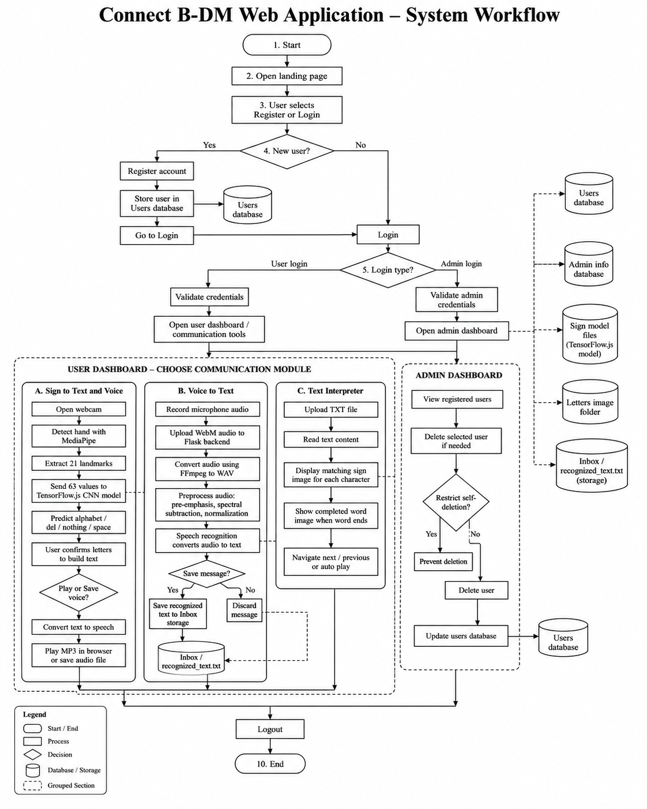

# Connect B-DM: A Communication Platform for Blind and Deaf-Mute Web Application


Connect B-DM is a browser-based accessibility project that brings sign, text, and voice tools into one place. It was built with Python, Flask, MySQL, HTML, CSS, JavaScript, TensorFlow.js, MediaPipe Hands, and basic digital audio processing.

The application has three main communication modules: **sign-to-text and voice**, **voice-to-text**, and **text-to-sign interpretation**. It also includes user registration, separate user and administrator login, session handling, and an admin panel for viewing and removing registered users.

---

## Core Idea

Connect B-DM was built around one simple idea: let people move between **signs, text, and speech** without opening three different applications.

A user can show supported ASL alphabet signs to a webcam, build readable text from the predictions, and play that text as speech. The same application can also record speech and turn it into text, or read a text file and display the matching sign image for each supported character.

---

## Problem Statement

People do not all communicate in the same way. Some depend mainly on signs, some use speech, and others need information shown as readable text. Communication becomes difficult when there is no simple bridge between these methods.

Connect B-DM was created as a college accessibility project to bring sign recognition, speech recognition, text interpretation, and voice generation together in one web application. It is not meant to replace a trained interpreter or support every form of sign language. Its purpose is to demonstrate how these technologies can work together in a practical system.

---

## Project Purpose

The purpose of this project is to make communication tools easier to access from one browser-based interface.

The project shows how:

- MediaPipe can find hand landmarks from a webcam image.
- A trained Conv1D model can classify supported static ASL alphabet signs.
- Accepted sign predictions can be joined into text.
- Text can be played or downloaded as speech.
- Recorded audio can be converted, cleaned, and sent for speech recognition.
- A text file can be shown one character at a time using stored sign images.
- Normal users and administrators can be managed with Flask sessions and MySQL.

This is an academic prototype intended mainly for local demonstration and testing.

---

## Main Features

### User account features

- Create a new user account.
- Check whether a username is already registered.
- Log in as a normal user.
- Log in as an administrator.
- Maintain the active login using Flask sessions.
- Log out and clear the current session.
- Display the logged-in username in the navigation bar.

### Sign-to-text and voice

- Access the computer webcam through the browser.
- Detect one hand using MediaPipe Hands.
- Extract 21 hand landmarks.
- Use the `x`, `y`, and `z` coordinates of each landmark.
- Send 63 landmark values to the TensorFlow.js model.
- Recognize 26 alphabet classes and the special classes `del`, `nothing`, and `space`.
- Show the latest prediction over the live camera.
- Press Enter to accept the current prediction.
- Add a space or delete a character using model predictions.
- Allow manual text entry when required.
- Clear the recognized text.
- Convert the completed text into speech.
- Play the generated speech in the browser.
- Save the generated speech as an MP3 file.

### Voice-to-text

- Record a voice message using the browser microphone.
- Upload the recording to the Flask backend.
- Convert browser-recorded WebM audio into WAV format using FFmpeg.
- Convert audio to mono, 16 kHz, 16-bit PCM.
- Apply pre-emphasis to the audio signal.
- Apply adaptive spectral subtraction for basic noise reduction.
- Normalize the processed audio.
- Convert the cleaned voice recording into text using speech recognition.
- Read instructions and recognized results using browser speech synthesis.
- Save recognized text into the project inbox.
- Discard the current message.
- Restart the recording process using keyboard controls.
- Process recordings inside a temporary folder and remove temporary files automatically.

### Text interpreter

- Upload a plain `.txt` file.
- Read the uploaded text directly in the browser.
- Display alphabet characters using stored sign-reference images.
- Show completed words when a space is reached.
- Generate an image for the completed word.
- Move to the next or previous character manually.
- Start the interpretation again from the beginning.
- Play and pause automatic character movement.
- Adjust the interpretation speed.
- Show unsupported characters using the default space image.

### Administrator features

- Log in using an administrator account.
- Open the registered-user management window.
- View registered user IDs and usernames.
- Delete selected user accounts.
- Prevent an administrator from deleting their own matching user account.
- Restrict user-management routes to authenticated administrators.

### Interface and accessibility features

- Responsive landing page.
- Draggable popup windows.
- Keyboard-based voice controls.
- ARIA labels on major buttons, inputs, dialogs, and status messages.
- Live status and error messages.
- Camera, microphone, text-file, login, registration, contact, and image popups.
- Clear separation between user and administrator controls.

---

## How the System Works

1. A visitor opens the Connect B-DM landing page.
2. The visitor creates an account or logs in.
3. The user opens the communication-tools window.
4. The user selects one of the three available communication tools.
5. For sign recognition, the browser captures webcam frames.
6. MediaPipe detects one hand and returns 21 hand landmarks.
7. The landmark coordinates are passed to the TensorFlow.js model.
8. The model predicts a supported letter or control class.
9. The user accepts predictions to build text.
10. The completed text can be played or saved as speech.
11. For voice recognition, the browser records a WebM audio message.
12. The Flask backend converts and preprocesses the recording.
13. Speech recognition converts the processed recording into text.
14. The user can save or discard the recognized message.
15. For text interpretation, the user selects a `.txt` file.
16. The browser displays each supported character using the matching sign image.
17. An administrator can separately log in and manage registered users.
18. The user logs out when communication is complete.

---

## System Workflow



---

## Technologies Used

| Part | Technology |
|---|---|
| Programming language | Python |
| Backend framework | Flask |
| Frontend | HTML5, CSS3, JavaScript |
| Template engine | Jinja |
| Database | MySQL |
| Database connection | mysql-connector-python |
| Browser sign model | TensorFlow.js |
| Model training | Keras / TensorFlow |
| Hand tracking in browser | MediaPipe Hands |
| Landmark extraction for training | MediaPipe Python |
| Image reading and conversion | OpenCV |
| Dataset and numeric processing | NumPy |
| Train/test split and metrics | scikit-learn |
| Training plots | Matplotlib |
| Dataset progress display | tqdm |
| Sign-recognition model | Conv1D neural network |
| Text-to-speech | gTTS |
| Browser speech output | Web Speech API |
| Speech recognition | SpeechRecognition |
| Audio conversion | FFmpeg |
| Audio processing | NumPy, SciPy |
| Image processing | Pillow |
| User authentication | Flask sessions |
| Dataset Link | https://www.kaggle.com/datasets/grassknoted/asl-alphabet/data |

TensorFlow.js, MediaPipe Hands, Google Fonts, and Font Awesome are loaded through CDN links when the web application runs.

The training tools are only needed when preparing the dataset or retraining the sign model. They are not required for normal use of the deployed web application.

---

## Communication Modules

### Sign-to-Text and Voice Module

The sign-recognition module runs mainly inside the browser.

```text
Webcam
   ↓
MediaPipe Hands
   ↓
21 hand landmarks
   ↓
63 coordinate values
   ↓
TensorFlow.js model
   ↓
Predicted letter or command
   ↓
Text
   ↓
gTTS-generated speech
```

The user presses Enter to accept the currently detected letter.

### Voice-to-Text Module

The voice-recognition module uses both the browser and Flask backend.

```text
Microphone recording
   ↓
WebM audio
   ↓
FFmpeg conversion
   ↓
16 kHz mono WAV
   ↓
Pre-emphasis
   ↓
Spectral subtraction
   ↓
Normalization
   ↓
Google speech recognition
   ↓
Recognized text
```

### Text Interpreter Module

The text interpreter works mainly inside the browser.

```text
TXT file
   ↓
Read file content
   ↓
Select current character
   ↓
Load matching sign image
   ↓
Display letter or completed word
```

---

## ASL Dataset Preparation

The model was trained from an image dataset arranged into separate class folders. The processing script reads the folders in sorted order, so each folder name becomes one model class.

The expected structure is similar to:

```text
asl_alphabet_train/
├── A/
├── B/
├── C/
├── ...
├── Z/
├── del/
├── nothing/
└── space/
```

The script accepts JPG, JPEG, and PNG images.

### Landmark extraction process

Each image is processed using the following steps:

1. OpenCV reads the image.
2. The image is converted from BGR to RGB because MediaPipe expects RGB input.
3. MediaPipe Hands checks the image for one hand.
4. When a hand is found, the first detected hand is used.
5. MediaPipe returns 21 hand landmarks.
6. The `x`, `y`, and `z` value of every landmark is collected.
7. The 21 landmarks become a flat vector of 63 values.
8. The class index is stored as the label.
9. Images that cannot be read or do not contain a detected hand are skipped.
10. The processed features, labels, and class names are saved in a compressed NPZ file.

The landmark extractor was configured with:

```text
Maximum hands: 1
Minimum detection confidence: 0.20
Output per image: 63 values
Feature data type: float32
Label data type: int32
```

The processed dataset is saved as:

```text
Processed_ASL_Dataset_Train.npz
```

The file contains:

```text
X        Landmark feature vectors
y        Numeric class labels
classes  Ordered class names
```

---

## Model Training

The training script loads the processed NPZ file and scales the landmark values using the largest value found in the feature array.

```python
X = X / np.max(X)
```

The dataset is then split using:

```text
Training pool: 70%
Held-out test set: 30%
Stratified split: Yes
Random state: 42
```

A further 10% of the training pool is used for validation during model fitting.

### Training settings

| Setting | Value |
|---|---:|
| Maximum epochs | 50 |
| Batch size | 64 |
| Optimizer | Adam |
| Default learning rate | 0.001 |
| Loss function | Sparse categorical cross-entropy |
| Training metric | Accuracy |
| Early-stopping monitor | Validation loss |
| Early-stopping patience | 7 epochs |
| Restore best weights | Yes |
| Save best model | Yes |

Early stopping prevents the model from continuing when validation loss no longer improves. The best model is also saved using a model checkpoint.

The Keras training script saves the model as:

```text
CNN_Landmark_Model_Improved.h5
```

For browser use, the trained model is converted to TensorFlow.js format and placed inside:

```text
static/models/CNN_Model/
```

---

## Model Development Files

The separate training package contains:

```text
ProcessASLDataset.py
CNN_Model_Improved.py
CNN_Model_Improved_Stats.txt
confusion_matrix.png
```

| File | Purpose |
|---|---|
| `ProcessASLDataset.py` | Reads ASL images and extracts 63 MediaPipe landmark values |
| `CNN_Model_Improved.py` | Splits the processed data, trains the Conv1D model, and calculates metrics |
| `CNN_Model_Improved_Stats.txt` | Stores accuracy, precision, recall, F1 score, and the class report |
| `confusion_matrix.png` | Shows actual classes against model predictions |

These files explain how the deployed sign model was prepared. They are not needed just to run the web application.

---

## Sign-Recognition Model

The deployed sign model runs in the browser through TensorFlow.js.

```text
static/models/CNN_Model/
├── model.json
├── group1-shard1of2.bin
└── group1-shard2of2.bin
```

### Model input

MediaPipe returns 21 landmarks for one hand. Each landmark contains three coordinates:

```text
x coordinate
y coordinate
z coordinate
```

This gives the model:

```text
21 landmarks × 3 coordinates = 63 input values
```

The 63 values are reshaped into `21 × 3` before passing through the convolution layers.

### Model architecture

```text
Input: 63 landmark values
Reshape: 21 × 3

Conv1D: 64 filters, kernel size 3, ReLU, same padding
Batch Normalization

Conv1D: 128 filters, kernel size 3, ReLU, same padding
Batch Normalization

Conv1D: 256 filters, kernel size 3, ReLU, same padding
Batch Normalization

Flatten
Dense: 256 units, ReLU
Dropout: 0.4
Output: 29 classes, Softmax
```

The convolution layers look for useful local relationships between nearby hand landmarks. Batch normalization helps keep training stable, while dropout reduces overfitting before the final prediction layer.

### Supported classes

```text
A, B, C, D, E, F, G, H, I, J,
K, L, M, N, O, P, Q, R, S, T,
U, V, W, X, Y, Z,
del, nothing, space
```

The model recognizes static alphabet-style signs and three control classes. It does not recognize full sign-language sentences or continuous moving gestures.

---

## Model Evaluation

The final model was evaluated on a held-out test set containing **22,050 processed landmark samples**.

### Overall results

| Metric | Result |
|---|---:|
| Accuracy | 99.15% |
| Weighted precision | 99.15% |
| Weighted recall | 99.15% |
| Weighted F1 score | 99.15% |

Most classes achieved precision, recall, and F1 scores between `0.99` and `1.00`.

The weaker classes were:

| Class | Precision | Recall | F1 score | Test samples |
|---|---:|---:|---:|---:|
| M | 0.96 | 0.95 | 0.95 | 658 |
| N | 0.95 | 0.96 | 0.96 | 617 |
| R | 0.98 | 0.99 | 0.98 | 780 |
| U | 0.98 | 0.98 | 0.98 | 798 |
| `del` | 0.98 | 1.00 | 0.99 | 584 |

The confusion matrix and full classification report were generated after testing.

### Important note about the result

The reported accuracy comes from the processed landmark dataset and the specific random split used during training. It should not be treated as a guarantee that the model will reach the same accuracy with every webcam, lighting condition, hand angle, background, or user.

The `nothing` class had only **one sample** in the test report. Its perfect score is therefore not enough to judge how well that class performs in real use.

The lower scores for `M` and `N` also make sense because those signs can have similar hand shapes. More varied training images and real webcam testing would give a better measure of practical performance.

---

## Audio Preprocessing

Before speech recognition, the recorded audio passes through several processing steps.

### WebM-to-WAV conversion

FFmpeg converts browser-recorded audio into:

```text
Sample rate: 16,000 Hz
Channels: 1
Encoding: 16-bit PCM
```

### Pre-emphasis

Pre-emphasis strengthens rapid changes and higher-frequency parts of the signal.

### Adaptive spectral subtraction

The system estimates background noise and subtracts part of its frequency magnitude from each audio frame.

### Normalization

The processed audio is scaled so its largest absolute sample is close to the permitted maximum.

These steps can improve some recordings, but they cannot remove every type of noise.

---

## Database

The application expects a MySQL database named:

```text
flask_db
```

The database name and connection values can be changed through environment variables.

### Required tables

The active Python code expects two tables:

| Table | Purpose |
|---|---|
| `users` | Stores normal user accounts |
| `admin_info` | Stores administrator login details |

### Database setup

Open MySQL or phpMyAdmin and run:

```sql
CREATE DATABASE flask_db;
USE flask_db;

CREATE TABLE users (
    id INT AUTO_INCREMENT PRIMARY KEY,
    username VARCHAR(100) NOT NULL UNIQUE,
    password VARCHAR(255) NOT NULL
);

CREATE TABLE admin_info (
    id INT AUTO_INCREMENT PRIMARY KEY,
    username VARCHAR(100) NOT NULL UNIQUE,
    password VARCHAR(255) NOT NULL
);
```

Create an administrator account for local testing:

```sql
INSERT INTO admin_info (username, password)
VALUES ('admin', 'change-this-password');
```

Replace the example password before running the project.

> The current academic version compares passwords as plain text. It should be upgraded to secure password hashing before public deployment.

---

## Important Project Files

```text
Connect_BDM(Web)/
├── DeafMuteMan/
│   └── Inbox/                         Saved recognized voice message
├── static/
│   ├── css/                           Interface stylesheets
│   ├── js/                            Frontend behavior and recognition logic
│   ├── letters/                       Alphabet and space sign images
│   ├── Logo/
│   │   └── logo1.png                  Active project logo
│   ├── models/
│   │   └── CNN_Model/                 TensorFlow.js sign model
│   └── sample.png                     Sample image displayed by the interface
├── templates/
│   ├── landingpage.html               Main landing page
│   ├── navbar.html                    Base page and shared navigation
│   ├── login_box.html                 Login popup
│   ├── register_box.html              Registration popup
│   ├── video_popup.html               Communication-tool selection
│   ├── sign_voice_popup.html          Sign-to-text and voice popup
│   ├── voice_popup.html               Voice-to-text popup
│   ├── interpret_popup.html           Text interpreter popup
│   ├── admin_users.html               Administrator user-management popup
│   ├── contact_box.html               Contact-information popup
│   └── image_popup.html               Sample-image popup
├── app.py                              Main Flask application
├── interpret_routes.py                 Word-image generation blueprint
├── voice_message.py                    Audio processing and voice routes
├── requirements.txt                    Python package requirements
├── REMOVED_FILES.txt                   Project cleanup record
└── README.md                           Project documentation
```

---

## Main Python Files

### `app.py`

This is the main Flask application. It manages:

- Application setup
- MySQL configuration
- Landing-page routes
- User registration
- User and administrator login
- Session handling
- Logout
- Text-to-speech generation
- Registered-user retrieval
- Administrator user deletion
- Blueprint registration

### `interpret_routes.py`

This blueprint generates a simple PNG image containing a completed word. The text interpreter displays that image whenever it reaches a space after a word.

### `voice_message.py`

This blueprint manages:

- Browser audio uploads
- FFmpeg conversion
- Pre-emphasis
- Spectral noise reduction
- Audio normalization
- Speech recognition
- Temporary audio files
- Saving recognized messages

---

## Main JavaScript Files

### `sign_voice_popup.js`

Manages webcam access, MediaPipe Hands, TensorFlow.js prediction, predicted-text controls, and text-to-speech requests.

### `voice_popup.js`

Manages microphone recording, keyboard controls, backend audio upload, recognized text, browser instructions, saving, and discarding.

### `interpret_popup.js`

Reads uploaded text files, displays sign-reference images, controls automatic playback, and changes interpretation speed.

### `login_box.js`

Sends login information to Flask and switches between user and administrator login modes.

### `register_box.js`

Checks registration details, checks username availability, and creates a user account.

### `admin_users.js`

Loads registered users and sends administrator requests to delete selected users.

### `popup_manager.js`

Controls popup ordering so the selected popup appears above the others.

---

## Installation

### Requirements

- Python 3.10 or newer recommended
- MySQL Server or MariaDB
- FFmpeg
- A modern browser
- Webcam for sign recognition
- Microphone for voice recognition
- Internet connection for CDN scripts, Google Text-to-Speech, and Google speech recognition

### Clone the repository

```bash
git clone https://github.com/HashTagNoob/Projects.git
cd "Projects/Connect_BDM(Web)"
```

### Create a virtual environment

```bash
python -m venv .venv
```

### Activate the virtual environment

#### Windows Git Bash

```bash
source .venv/Scripts/activate
```

#### Windows Command Prompt

```bat
.venv\Scripts\activate
```

#### Windows PowerShell

```powershell
.venv\Scripts\Activate.ps1
```

#### Linux or macOS

```bash
source .venv/bin/activate
```

### Install Python packages

```bash
python -m pip install --upgrade pip
pip install -r requirements.txt
```

### Optional packages for model training

The web application can run without the training scripts. To process the ASL image dataset or retrain the model, the training environment also needs:

```text
tensorflow
keras
opencv-python
mediapipe
numpy
scikit-learn
matplotlib
tqdm
```

These packages may be installed in a separate training environment to avoid changing the runtime environment used by the Flask application.

### Install FFmpeg

Install FFmpeg and make sure the `ffmpeg` command works:

```bash
ffmpeg -version
```

The project also checks this default Windows location:

```text
C:\Program Files\ffmpeg\bin\ffmpeg.exe
```

A different FFmpeg location can be supplied through the `FFMPEG_PATH` environment variable.

---

## Environment Variables

The project supports these environment variables:

| Variable | Default value | Purpose |
|---|---|---|
| `FLASK_SECRET_KEY` | `connect-bdm-local-key` | Flask session signing key |
| `DB_HOST` | `localhost` | MySQL host |
| `DB_USER` | `root` | MySQL username |
| `DB_PASSWORD` | Empty | MySQL password |
| `DB_NAME` | `flask_db` | MySQL database |
| `FFMPEG_PATH` | System/default path | FFmpeg executable |
| `FLASK_DEBUG` | `true` | Flask debug mode |

### Example for Windows Git Bash

```bash
export FLASK_SECRET_KEY="replace-with-a-random-secret"
export DB_HOST="localhost"
export DB_USER="root"
export DB_PASSWORD=""
export DB_NAME="flask_db"
export FFMPEG_PATH="/c/Program Files/ffmpeg/bin/ffmpeg.exe"
export FLASK_DEBUG="true"
```

### Example for Windows PowerShell

```powershell
$env:FLASK_SECRET_KEY="replace-with-a-random-secret"
$env:DB_HOST="localhost"
$env:DB_USER="root"
$env:DB_PASSWORD=""
$env:DB_NAME="flask_db"
$env:FFMPEG_PATH="C:\Program Files\ffmpeg\bin\ffmpeg.exe"
$env:FLASK_DEBUG="true"
```

---

## Running the Application

1. Start MySQL.
2. Confirm that the `flask_db` database and required tables exist.
3. Activate the Python virtual environment.
4. Run:

```bash
python app.py
```

5. Open the following address:

```text
http://127.0.0.1:5000/
```

The root route redirects to:

```text
http://127.0.0.1:5000/landing
```

---

## How to Use the Application

### Create a user account

1. Open the landing page.
2. Select the user icon.
3. Select **Create an account**.
4. Enter a username.
5. Enter and confirm the password.
6. Submit the registration form.
7. Return to the login window and log in.

### Use sign-to-text and voice

1. Log in.
2. Open **Communication Tools**.
3. Select **Sign to Text and Voice**.
4. Allow webcam access.
5. Wait for the model to load.
6. Show one supported hand sign.
7. Press Enter to accept the displayed prediction.
8. Repeat the process to create text.
9. Select **Play Voice** to hear the text.
10. Select **Save Voice** to download the MP3 file.
11. Select **Clear** to remove the current text.

### Use voice-to-text

1. Log in.
2. Open **Communication Tools**.
3. Select **Voice to Text**.
4. Allow microphone access.
5. Press Enter to start recording.
6. Speak the message.
7. Press Enter again to stop recording.
8. Wait for the processed text.
9. Press `K` to save the recognized text.
10. Press `J` to discard it.
11. Press `F` to start again.

### Use the text interpreter

1. Open **Communication Tools**.
2. Select **Text Interpreter**.
3. Choose a plain `.txt` file.
4. Select **Play** to move through the text automatically.
5. Use **Previous** or **Next** for manual movement.
6. Use **Pause** to stop.
7. Use **Start Over** to return to the first character.
8. Adjust the playback-speed slider as required.

### Manage users as an administrator

1. Open the login popup.
2. Select **Admin**.
3. Enter an administrator username and password.
4. Log in.
5. Select the registered-users icon.
6. Review the user list.
7. Delete a user when required.

---

## Saved Voice Message

When the user saves recognized voice text, the application creates or updates:

```text
DeafMuteMan/Inbox/recognized_text.txt
```

The latest saved message replaces the previous content of this file.

---

## Browser Permissions

The application may request:

- Camera access for sign recognition
- Microphone access for voice recording
- File access when selecting a text file

Allow only the permissions required for the selected feature.

Camera and microphone access normally work on `localhost`. A public deployment should use HTTPS.

---

## Security Included

The project includes some basic controls:

- Parameterized MySQL queries for user-provided values
- Flask sessions for login state
- Separate user and administrator login modes
- Administrator checks on user-management routes
- Protection against an administrator deleting their own matching user account
- Temporary audio processing with automatic cleanup
- File-length validation for generated word images
- Basic request validation and error responses

---

## Security and Deployment Limitations

The current version is suitable for academic demonstration, not public production.

Important limitations include:

- User and administrator passwords are stored and compared as plain text.
- The application contains a fallback Flask secret key.
- Debug mode is enabled by default.
- Registration does not enforce a strong password policy.
- There is no CSRF protection.
- There is no login rate limiting.
- There is no email verification or password recovery.
- There is no account-lockout mechanism.
- The voice-recognition and text-to-speech features rely on online Google services.
- CDN resources must be available for TensorFlow.js and MediaPipe Hands.
- The application does not provide database migration files.
- Saved recognized text is stored in a single local text file.
- The generated speech endpoint does not require login.
- Public deployment requires HTTPS and secure environment variables.

Before public deployment, password hashing, CSRF protection, secure cookies, rate limiting, HTTPS, production database settings, and disabled debug mode should be added.

---

## Current Limitations

The current version does not include:

- Recognition of complete sign-language sentences
- Continuous dynamic-gesture recognition
- Multiple-hand recognition
- Recognition of numbers or punctuation
- Confidence-score display for sign predictions
- Automatic acceptance after a prediction remains stable
- Strong evaluation across different cameras, backgrounds, and lighting conditions
- A balanced practical test for the `nothing` class
- Offline speech recognition
- Offline text-to-speech
- Multiple saved voice messages
- Message history inside the database
- Direct communication between two logged-in users
- Video calling
- Real-time chat
- Password recovery
- Email or OTP verification
- Profile management
- Model retraining through the web application
- Full interpretation of unsupported text characters

---

## Future Enhancements

Possible future improvements include:

- Password hashing using Werkzeug or bcrypt
- CSRF protection and login rate limiting
- User profiles and password recovery
- Database-based communication history
- Real-time messaging using WebSockets
- Offline speech recognition
- Offline text-to-speech
- Sign-prediction confidence scores
- Stable-frame prediction confirmation
- More balanced data for every sign class
- Data collection from different users, cameras, angles, and lighting conditions
- Separate real-world webcam evaluation
- Dynamic sign recognition using sequence models
- Number and punctuation classes
- Two-hand gesture support
- Nepali language support
- Multiple saved inbox messages
- Downloadable recognized-text history
- Improved audio denoising
- Automated backend and frontend tests
- Docker-based setup
- Production deployment configuration

---

## Troubleshooting

### MySQL connection error

Confirm that MySQL is running and the database settings are correct.

Check:

```text
DB_HOST
DB_USER
DB_PASSWORD
DB_NAME
```

### Database table error

Create the `users` and `admin_info` tables using the SQL provided in the Database section.

### FFmpeg not found

Run:

```bash
ffmpeg -version
```

When FFmpeg is installed elsewhere, set `FFMPEG_PATH`.

### Camera does not open

- Allow browser camera permission.
- Close other applications using the camera.
- Use a modern browser.
- Open the application through `localhost` or HTTPS.

### Microphone does not open

- Allow microphone permission.
- Check the selected operating-system input device.
- Close other applications using the microphone.

### Sign model does not load

Check that these files exist:

```text
static/models/CNN_Model/model.json
static/models/CNN_Model/group1-shard1of2.bin
static/models/CNN_Model/group1-shard2of2.bin
```

Also confirm that the browser can access the TensorFlow.js and MediaPipe CDN files.

### Voice recognition returns an error

- Check the internet connection.
- Confirm that FFmpeg can convert the recording.
- Record in a quieter environment.
- Speak clearly and keep the recording short.

### Text-to-speech does not work

The `gTTS` service requires internet access. Check the connection and try again.

### Text interpreter does not display a letter

Check that the corresponding file exists inside:

```text
static/letters/
```

Only alphabet characters and spaces are directly supported.

### Application does not start

Activate the virtual environment and run:

```bash
pip install -r requirements.txt
python app.py
```

Read the terminal error message for the missing package or configuration.

---

## Author

**Shivesh Shrestha**

---

## Summary

Connect B-DM is an academic accessibility web application that brings sign, text, and voice tools together in one place. MediaPipe extracts 21 hand landmarks, a Conv1D model classifies 29 supported sign classes, and TensorFlow.js runs the converted model directly in the browser. The project also uses Flask and gTTS for speech output, FFmpeg and signal processing for recorded audio, Google speech recognition for voice-to-text, and stored sign images for text interpretation.

The sign model was trained from MediaPipe landmark data using a stratified train/test split, early stopping, and model checkpointing. On the provided held-out test set, it reached 99.15% accuracy, weighted precision, weighted recall, and weighted F1 score. These results are strong for the processed dataset, but real-world performance still depends on camera quality, lighting, hand position, background, and how closely the shown sign matches the training data.
