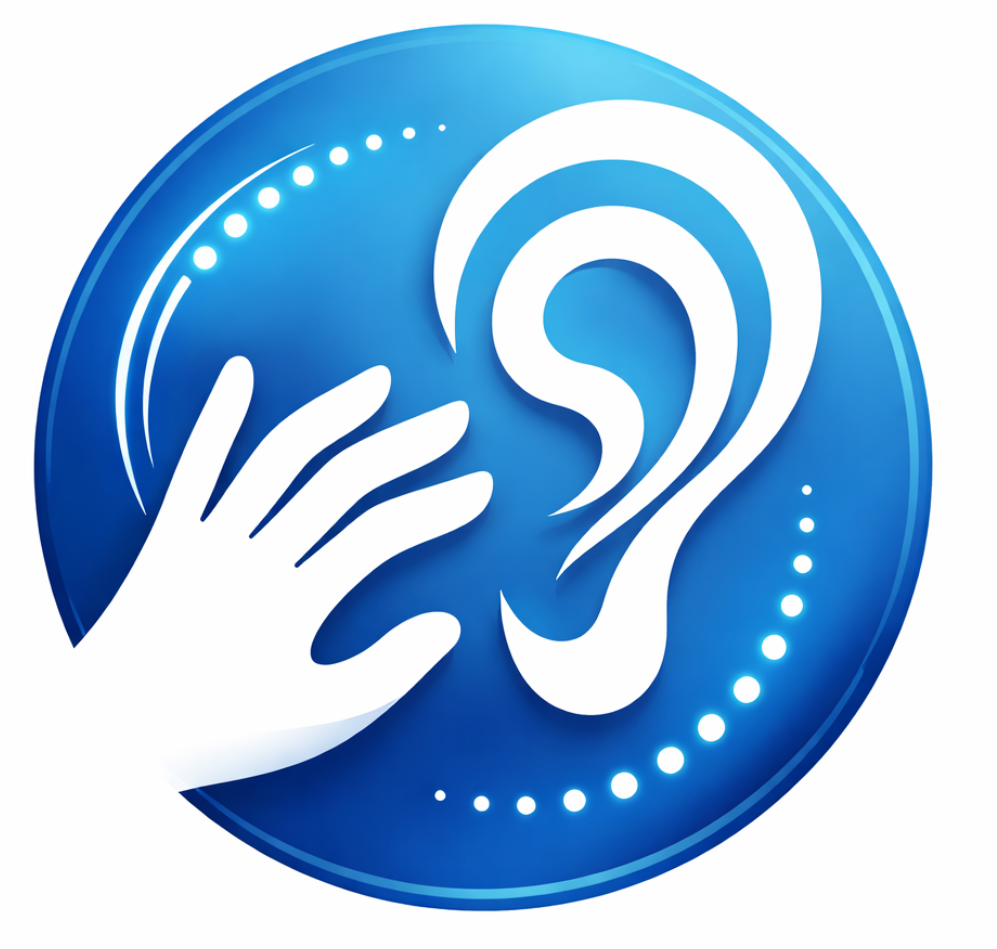
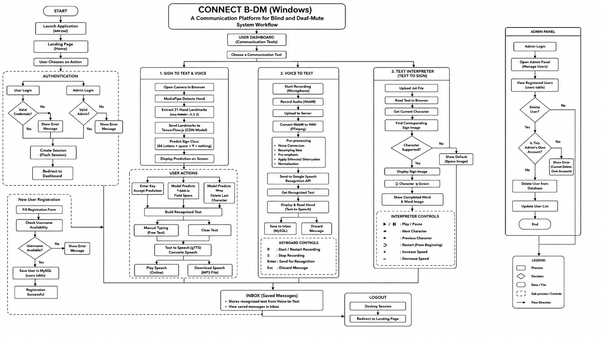

# Connect B-DM (Windows): A Communication Platform for Blind and Deaf Mute 

<p align="center">
  
</p>

**Connect B-DM** is a Windows desktop application that brings **voice, text, and hand-sign communication** into one simple interface. It supports voice-to-text conversion, sign-to-voice communication using CNN or KNN, and text-to-sign interpretation with stored ASL alphabet images.

The project is built as an academic accessibility prototype using Python, Tkinter, MediaPipe, OpenCV, NumPy, SpeechRecognition, and text-to-speech tools.

---

## Table of Contents

- [Core Idea](#core-idea)
- [Problem Statement](#problem-statement)
- [Project Purpose](#project-purpose)
- [Main Features](#main-features)
- [Keyboard Shortcuts](#keyboard-shortcuts)
- [How the System Works](#how-the-system-works)
- [System Workflow](#system-workflow)
- [System Design Diagram](#system-design-diagram)
- [Technologies Used](#technologies-used)
- [Communication Modules](#communication-modules)
- [ASL Dataset Preparation](#asl-dataset-preparation)
- [Model Training](#model-training)
- [Model Evaluation](#model-evaluation)
- [Installation](#installation)
- [Running the Application](#running-the-application)
- [How to Use the Application](#how-to-use-the-application)
- [Troubleshooting](#troubleshooting)

---

## Core Idea

Connect B-DM was created around one clear idea: allow a person to move between **speech, text, and hand signs** without using separate applications.

A user can speak and save the recognised text, show alphabet signs to a webcam and create an audio message, or open a text file and view its matching sign images one character at a time.

---

## Problem Statement

People do not all communicate in the same way. A blind person may depend on speech, while a deaf or mute person may depend on signs or written text. Communication becomes difficult when these methods cannot be converted into one another easily.

Connect B-DM provides a practical desktop bridge between these communication methods. It is an academic prototype and is not intended to replace a trained sign-language interpreter.

---

## Project Purpose

The project demonstrates how a desktop application can combine:

- Voice recording and speech recognition
- Basic audio cleaning before recognition
- MediaPipe hand-landmark detection
- CNN and KNN sign classification
- Stable-gesture confirmation and automatic sign entry
- Text-to-speech audio generation
- Text-to-sign image interpretation
- Light and dark interface themes
- Keyboard-first navigation for faster use

---

## Main Features

### Voice-to-text

- Records speech from the system microphone
- Uses `J` to start and `K` to stop listening
- Applies pre-emphasis, spectral subtraction, and normalisation
- Converts processed speech into text using Google Speech Recognition
- Reads the recognised result aloud
- Saves each message as a timestamped `.txt` file
- Allows recognised text to be reviewed or edited before saving

### Sign-to-voice

- Opens the computer webcam
- Detects one hand with MediaPipe Hands
- Extracts 21 hand landmarks, producing 63 coordinate values
- Lets the user choose between **CNN** and **KNN** prediction
- Shows the detected class and confidence score
- Smooths predictions across recent camera frames
- Adds signs manually with `Alt`
- Can automatically add a stable sign after a visible countdown
- Supports alphabet classes plus `del`, `nothing`, and `space`
- Saves the completed message as a `.wav` audio file

### Text-to-sign interpretation

- Opens any plain `.txt` file
- Opens the newest saved voice-to-text message directly
- Displays one stored sign image for each alphabet character
- Highlights the current character inside the complete message
- Shows the current word below the sign image
- Supports previous, next, play, pause, and restart controls
- Allows playback speed to be adjusted from 200 to 2000 milliseconds

### Interface and accessibility

- Light theme is used by default
- Dark theme can be enabled from each main window
- Main pages and control panels support scrolling
- Large tool windows open maximised when possible
- `Ctrl+H` returns to Home and closes extra project windows
- The project logo is loaded from `logo.png`

---

## Keyboard Shortcuts

| Shortcut | Where it works | Action |
|---|---|---|
| `J` | Home or Voice-to-text page | Opens voice mode and starts listening |
| `K` | While listening | Stops recording and begins speech recognition |
| `Ctrl+S` | Voice-to-text page | Saves the recognised or typed text |
| `Ctrl+H` | Main app, sign window, or text-to-sign window | Stops the active task, closes extra windows, and returns Home |
| `Alt` | Sign-recognition window | Adds the currently detected sign |
| `Esc` | Sign-recognition window | Closes only the sign-recognition window |

> `Alt` adds a letter without inserting a new line. The on-screen **Add sign (Alt)** button performs the same action.

---

## How the System Works

1. The user starts the program through `Main.py`.
2. The Home page provides access to Voice-to-text and Sign-to-voice tools.
3. In Voice-to-text mode, the microphone records until the user presses `K`.
4. The recording is cleaned and passed to speech recognition.
5. The recognised text is shown, spoken aloud, and can be saved with `Ctrl+S`.
6. In Sign-to-voice mode, the user chooses CNN or KNN and opens the camera.
7. MediaPipe extracts 21 hand landmarks from each useful camera frame.
8. The selected model predicts one of the 29 supported classes.
9. The user adds signs manually or enables automatic stable-sign entry.
10. The completed message can be saved as speech.
11. The Text-to-sign tool reads a text file and shows the matching sign image for each character.

---

## System Workflow

### Voice-to-text workflow

```text
Microphone
   ↓
16 kHz mono recording
   ↓
Pre-emphasis
   ↓
Adaptive spectral subtraction
   ↓
Audio normalisation
   ↓
Google Speech Recognition
   ↓
Editable text
   ↓
Saved text message
```

### Sign-to-voice workflow

```text
Webcam
   ↓
MediaPipe Hands
   ↓
21 landmarks × 3 coordinates
   ↓
63 landmark values
   ↓
CNN or KNN prediction
   ↓
Stable sign confirmation
   ↓
Text message
   ↓
WAV voice file
```

### Text-to-sign workflow

```text
Text file or newest saved message
   ↓
Read one character
   ↓
Load matching image from Interpretation/
   ↓
Display sign and highlight character
   ↓
Move manually or play automatically
```

---

## System Design Diagram
Here is the flowchart for this program.



---

## Technologies Used

| Area | Technology |
|---|---|
| Programming language | Python 3.10 |
| Desktop interface | Tkinter and ttk |
| Hand detection | MediaPipe Hands |
| Camera processing | OpenCV |
| Image handling | Pillow |
| Numerical processing | NumPy |
| CNN training | TensorFlow 2.10.1 / Keras 2.10 |
| CNN desktop prediction | NumPy runtime using exported CNN weights |
| KNN prediction | NumPy-based nearest-neighbour comparison |
| Dataset splitting and evaluation | scikit-learn |
| Training graphs | Matplotlib |
| Microphone recording | sounddevice |
| Audio processing | NumPy and SciPy |
| Speech recognition | SpeechRecognition with Google recognition |
| Text-to-speech | pyttsx3 |
| Progress display | tqdm |
| Dataset reference | [ASL Alphabet Dataset](https://www.kaggle.com/datasets/grassknoted/asl-alphabet/data) |

The normal desktop application does **not** import TensorFlow during prediction. TensorFlow is only required when retraining the CNN.

---

## Communication Modules

### Sign-to-Text and Voice Module

The sign-recognition window uses MediaPipe to track one hand and converts its 21 landmarks into 63 values. The selected CNN or KNN model predicts a letter or control class. The user can type manually, add a space, delete the last character, clear the message, or save it as audio.

The prediction is accepted only after several recent frames agree. Automatic entry is optional and uses a **1.5-second countdown** while the same sign remains stable.

### Voice-to-Text Module

The voice module records audio at **16,000 Hz** with one channel. The recording is cleaned, written temporarily as WAV audio, and passed to speech recognition. The recognised message is displayed and spoken aloud before the user saves it.

### Text Interpreter Module

The text interpreter opens a `.txt` file or the newest message from `DeafMuteMan/Inbox`. It loads images from the `Interpretation` folder and shows them one character at a time. Spaces display the completed previous word, while punctuation is shown as a simple text card.

---

## ASL Dataset Preparation

The dataset-processing script expects one folder per class:

```text
asl_alphabet_train/
├── A/
├── B/
├── C/
├── ...
├── Z/
├── del/
├── nothing/
└── space/
```

Supported input formats are `.jpg`, `.jpeg`, `.png`, `.bmp`, and `.webp`.

For every usable image, the script:

1. Reads the image with OpenCV.
2. Converts it from BGR to RGB.
3. Detects the first hand with MediaPipe.
4. Extracts the `x`, `y`, and `z` values from 21 landmarks.
5. Saves the resulting 63-value vector with its class label.

The included processed dataset contains:

```text
73,500 landmark samples
63 values per sample
29 classes
Feature type: float32
Label type: int32
```

The saved file is:

```text
Processed_ASL_Dataset/Processed_ASL_Dataset_Train.npz
```

### Process the raw dataset again

Dataset processing uses the packages already listed in `requirements.txt`:

```powershell
conda activate "Connect_BDM(Windows)"
python training\process_dataset.py --dataset "E:\path\to\asl_alphabet_train"
```

---

## Model Training

### CNN training

The CNN receives 63 values and reshapes them into `21 × 3` landmark coordinates.

```text
Input: 63 values
Reshape: 21 × 3
Conv1D: 64 filters + Batch Normalisation
Conv1D: 128 filters + Batch Normalisation
Conv1D: 256 filters + Batch Normalisation
Flatten
Dense: 256 units
Dropout: 0.4
Output: 29-class Softmax
```

Default CNN settings:

| Setting | Value |
|---|---:|
| Maximum epochs | 50 |
| Batch size | 64 |
| Test split | 30% |
| Validation split | 10% of the training set |
| Random state | 42 |
| Optimizer | Adam |
| Loss | Sparse categorical cross-entropy |
| Early-stopping patience | 7 epochs |
| Learning-rate reduction patience | 3 epochs |

Training saves the Keras model, evaluation report, confusion matrix, training graph, metadata, and NumPy runtime weights.

### KNN training

The KNN model stores normalised training landmarks and predicts from the nearest saved samples. Its default value is:

```text
K = 5
```

The same stratified 70/30 train-test split and random state `42` are used.

### Training environment

Keep model training separate from the normal desktop environment:

```powershell
conda create --name Connect_BDM_Training python=3.10 pip -y
conda activate Connect_BDM_Training
python -m pip install --upgrade pip
pip install -r requirements-training.txt
```

Train the CNN:

```powershell
python training\train_cnn.py --epochs 50 --batch-size 64
```

Train KNN:

```powershell
python training\train_knn.py --k 5
```

The training requirements use **TensorFlow 2.10.1**. For native Windows NVIDIA GPU training, the project was prepared around CUDA 11.2 and cuDNN 8.1.

---

## Model Development Files

| File | Purpose |
|---|---|
| `training/process_dataset.py` | Converts class-based ASL images into MediaPipe landmark data |
| `training/train_cnn.py` | Trains, evaluates, and exports the CNN |
| `training/train_knn.py` | Trains and evaluates the KNN model |
| `CNN_Model_Improved.h5` | Saved TensorFlow/Keras CNN model |
| `CNN_Runtime_Weights.npz` | CNN arrays used by the desktop NumPy runtime |
| `cnn_metadata.json` | CNN class order and normalisation factor |
| `knn_model.npz` | Saved KNN samples, labels, class names, and settings |
| `CNN_Evaluation_Metrics.txt` | CNN classification metrics and report |
| `KNN_Evaluation_Metrics.txt` | KNN classification metrics and report |
| `CNN_Confusion_Matrix.png` | CNN prediction comparison by class |
| `KNN_Confusion_Matrix.png` | KNN prediction comparison by class |

---

## Sign-Recognition Model

### Model input

MediaPipe provides 21 landmarks. Each landmark contains:

```text
x coordinate
y coordinate
z coordinate
```

Therefore:

```text
21 landmarks × 3 coordinates = 63 input values
```

### Supported classes

```text
A, B, C, D, E, F, G, H, I, J,
K, L, M, N, O, P, Q, R, S, T,
U, V, W, X, Y, Z,
del, nothing, space
```

### Runtime behaviour

- Prediction smoothing window: 8 recent frames
- Minimum recent-frame agreement: 60%
- Default CNN confidence threshold: 85%
- Default KNN confidence threshold: 80%
- Adjustable threshold range: 50% to 100%
- Automatic-add hold time: 1.5 seconds
- Minimum visible hand size check: 0.12 of the normalised frame span

The `del` class removes the last character, `space` inserts a space, and `nothing` adds no text.

---

## Model Evaluation

The included evaluation used a held-out test set of **22,050 samples**.

| Model | Accuracy | Weighted Precision | Weighted Recall | Weighted F1 |
|---|---:|---:|---:|---:|
| CNN | 99.15% | 99.15% | 99.15% | 99.15% |
| KNN (`K=5`) | 97.55% | 97.56% | 97.55% | 97.55% |

The CNN performed better overall, while KNN remains useful as a simpler comparison model.

> These figures describe the included processed landmark test set. Real webcam performance can change with lighting, camera quality, hand distance, background, angle, and user differences. The `nothing` class contains very few samples, so its evaluation is not reliable on its own.

---

## Audio Preprocessing

The voice module uses the following settings:

| Setting | Value |
|---|---:|
| Sample rate | 16,000 Hz |
| Channels | 1 |
| Frame size | 1,024 samples |
| Frame overlap | 512 samples |
| Pre-emphasis coefficient | 0.97 |

Processing steps:

1. Record microphone samples.
2. Apply pre-emphasis.
3. Estimate steady background noise.
4. Apply adaptive spectral subtraction to overlapping frames.
5. Normalise the cleaned signal.
6. Save temporary input and processed WAV files in `.runtime`.
7. Send the processed recording to speech recognition.

---

## Database

This desktop version does not use a database. It stores recognised text and generated audio as local files inside the project folders.

---

## Important Project Files

```text
Connect_BDM(Windows)/
├── Main.py
├── B2DM.py
├── GestureRecognition.py
├── InterpretText.py
├── model_utils.py
├── ui_common.py
├── logo.png
├── requirements.txt
├── requirements-training.txt
├── Interpretation/
│   ├── a.png ... z.png
│   └── space.png
├── Models/
│   ├── CNN_Model_File/
│   └── KNN_Model_File/
├── Processed_ASL_Dataset/
│   └── Processed_ASL_Dataset_Train.npz
└── training/
    ├── process_dataset.py
    ├── train_cnn.py
    └── train_knn.py
```

These folders are created automatically when needed:

```text
DeafMuteMan/Inbox/   Saved voice-to-text messages
BlindMan/Inbox/      Saved sign-to-voice WAV files
.runtime/            Temporary audio and window-control files
```

---

## Main Python Files

### `Main.py`

Runs the main Tkinter application, page navigation, theme switching, global shortcuts, voice controls, and child-window management.

### `B2DM.py`

Records microphone audio, performs basic noise reduction, recognises speech, speaks instructions, and saves text messages.

### `GestureRecognition.py`

Runs webcam-based sign recognition, prediction smoothing, manual or automatic sign entry, message editing, and audio saving.

### `InterpretText.py`

Reads text files and displays matching sign images with manual or automatic playback.

### `model_utils.py`

Loads the CNN runtime weights or KNN model and provides a shared prediction interface.

### `ui_common.py`

Contains shared themes, button styles, responsive window helpers, the logo header, and scrollable frames.

---

## Main JavaScript Files

This desktop version does not use JavaScript. The interface and application logic are written in Python with Tkinter.

---

## Installation

### Requirements

- Windows 10 or Windows 11
- Anaconda or Miniconda
- Python 3.10
- Webcam for sign recognition
- Microphone for voice recognition
- Internet connection for Google Speech Recognition

### Create the Conda environment

Open Anaconda Prompt or PowerShell:

```powershell
conda create --name "Connect_BDM(Windows)" python=3.10 pip -y
conda activate "Connect_BDM(Windows)"
```

Move into the extracted project folder:

```powershell
cd "E:\path\to\Connect_BDM(Windows)"
```

Install the desktop packages:

```powershell
python -m pip install --upgrade pip
python -m pip install --upgrade --force-reinstall -r requirements.txt
```

---

## Environment Variables

No environment variables are required for normal use. The application creates its internal runtime paths automatically.

---

## Running the Application

Activate the environment and open the project folder:

```powershell
conda activate "Connect_BDM(Windows)"
cd "E:\path\to\Connect_BDM(Windows)"
python Main.py
```

Always start the complete application with `Main.py`.

---

## How to Use the Application

### Use voice-to-text

1. Open the application.
2. Press `J` from Home or open **Voice to text**.
3. Speak after listening begins.
4. Press `K` when finished.
5. Review or edit the recognised text.
6. Press `Ctrl+S` or select **Save text**.

### Use sign-to-voice

1. Open **Sign to voice**.
2. Choose **CNN** or **KNN**.
3. Select **Open camera**.
4. Hold one hand clearly in view.
5. Wait for a stable prediction.
6. Press `Alt` to add the sign, or enable automatic adding.
7. Use **Add space**, **Delete last**, or manual typing when needed.
8. Select **Save as audio** when the message is complete.

### Use text-to-sign

1. Open **Sign to voice**.
2. Select **Show text as signs**.
3. Choose **Open a text file** or **Open newest saved message**.
4. Use **Previous**, **Next**, **Play**, **Pause**, or **Start again**.
5. Adjust the speed slider as needed.

---

## Saved Voice Message

Voice-to-text messages are saved as:

```text
DeafMuteMan/Inbox/message_YYYY-MM-DD_HH-MM-SS.txt
```

Sign-to-voice messages are saved as:

```text
BlindMan/Inbox/voice_YYYY-MM-DD_HH-MM-SS.wav
```

The text-to-sign window can open the newest file from `DeafMuteMan/Inbox` automatically.

---

## Device Permissions

The application may need access to:

- The webcam for sign recognition
- The microphone for voice recording
- The speaker or system voice for spoken instructions
- Local files when opening text or saving messages

Close other programs using the webcam or microphone before starting these tools.

---

## Security Included

- Runs as a local desktop application
- Does not require user accounts or a database
- Creates timestamped output files instead of overwriting older messages
- Cleans up open camera and child-window processes when closing
- Keeps temporary audio inside the local `.runtime` folder

---

## Security and Deployment Limitations

- Google Speech Recognition requires an internet connection and processes the submitted audio through an online service.
- The application does not encrypt locally saved messages or audio files.
- Anyone with access to the project folder may read its saved files.
- This version is intended for academic demonstration and local use, not sensitive or clinical communication.

---

## Current Limitations

- Recognises one hand at a time
- Works with alphabet-style classes rather than continuous sign-language sentences
- Does not recognise numbers or punctuation as trained sign classes
- Dynamic signs depend on how they appear in the training dataset
- Accuracy can fall under poor lighting, unusual angles, or unclear hand placement
- Speech recognition depends on internet access and microphone quality
- Text-to-speech output depends on voices installed in Windows
- The `nothing` class has very limited processed data
- Messages are stored as local files without an in-app history manager

---

## Future Enhancements

- Dynamic sign recognition using video sequences
- Two-hand gesture support
- Number and punctuation classes
- More balanced data for every class
- Offline speech recognition
- Nepali and additional language support
- Searchable message history
- Direct message exchange between users
- Improved background-noise removal
- Packaged Windows executable
- Automated model and interface tests

---

## Troubleshooting

### MediaPipe or protobuf import error

Reinstall the pinned desktop packages:

```powershell
python -m pip install --upgrade --force-reinstall -r requirements.txt
```

The desktop requirements use `protobuf==3.20.3` for the included MediaPipe setup.

### TensorFlow import error while running the app

TensorFlow is not needed for normal prediction. Activate the desktop environment and install only `requirements.txt`.

### Camera does not open

- Close other camera applications.
- Check Windows camera permissions.
- Confirm the webcam is connected.
- Restart the sign-recognition window.

### Microphone does not record

- Check Windows microphone permissions.
- Confirm the correct input device is selected.
- Close other programs using the microphone.
- Make sure `sounddevice` and `pywin32` installed successfully.

### Speech recognition cannot connect

- Check the internet connection.
- Speak clearly and keep the recording reasonably short.
- Try again in a quieter room.

### CNN or KNN model does not load

Confirm these files exist:

```text
Models/CNN_Model_File/CNN_Runtime_Weights.npz
Models/CNN_Model_File/cnn_metadata.json
Models/KNN_Model_File/knn_model.npz
```

### Sign image is missing

Confirm the matching lowercase image exists inside `Interpretation`, for example:

```text
Interpretation/a.png
Interpretation/space.png
```

### Logo is not displayed

Keep the logo at:

```text
Connect_BDM(Windows)/logo.png
```

---

## Author

**Shivesh Shrestha**

---

## Summary

Connect B-DM is a Windows accessibility project that combines voice, text, and hand-sign tools in one desktop application. It can turn speech into saved text, use CNN or KNN landmark models to build messages from hand signs, convert those messages into audio, and display text through ASL alphabet images.

The included CNN achieved **99.15%** accuracy on the supplied landmark test set, while the KNN model achieved approximately **97.55%**. These results are strong for the processed dataset, but practical performance still depends on the camera, lighting, hand position, microphone, background noise, and internet connection.
